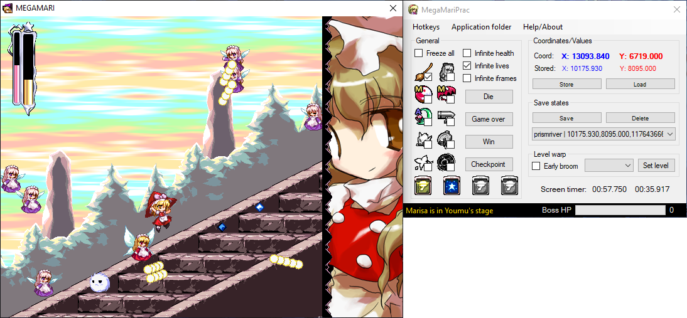

# MegaMariPrac
Speedrun practice tool for MegaMari. This project is heavily based off mpu's [RKS/F practice tool](https://github.com/mpumpu/rkshacks).

## How to use
Download the latest release [here](https://github.com/shadax1/MegaMariPrac/releases) and add the .exe file into your MegaMari game folder. Start the game followed by the practice tool and you will be good to go.

## Known issues
+ loading save states may sometimes make the character slowly zip into the ground
+ the following hotkeys are not working as expected yet and will be fixed in 1.00:
	+ load next stage
	+ load next save state

## Ideas/Improvements
+ make it so it selects `Continue` automatically when warping to another stage
+ have buttons for previous and next screen
+ faster win sequence

## Wiki
I documented a lot of things related to this game's memory addresses in the [wiki](https://github.com/shadax1/MegaMariPrac/wiki) if you're interested.

## Credit
[Krimmydoodle](https://www.twitch.tv/krimmydoodle) helped me by providing useful information regarding this game's memory addresses and both [Eeeh_Easy_Modo](https://www.twitch.tv/eeeh_easy_modo) & [xDrHellx](https://www.twitch.tv/xdrhellx) helped me when I was working on this project on stream, thanks bros 🫡

